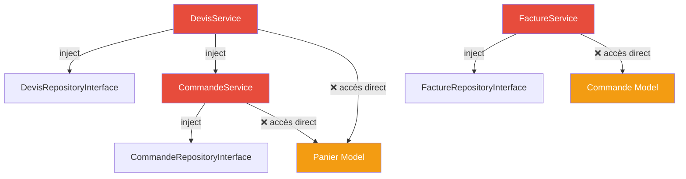
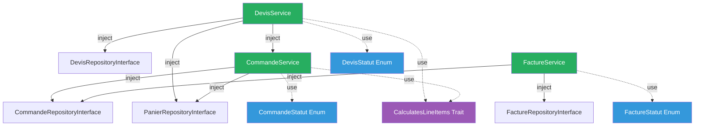

# 🔍 Analyse & Plan d'Amélioration — Services Sales

## Architecture Actuelle



---

## Problèmes Identifiés

### 1. 🔴 Statuts en chaînes magiques — Aucun typage fort

| Service | Statuts hardcodés |
|---------|-------------------|
| DevisService | `'brouillon'`, `'envoye'`, `'accepte'`, `'refuse'`, `'expire'` |
| CommandeService | `'en_attente'`, `'payee'`, `'en_traitement'`, `'expediee'`, `'terminee'`, `'annulee'`, `'remboursee'`, `'actif'`, `'commande'` |
| FactureService | `'brouillon'`, `'emise'`, `'payee'`, `'annulee'` |

> [!CAUTION]
> Les fautes de frappe dans ces chaînes sont silencieuses et ne génèrent aucune erreur à la compilation. Laravel 10 supporte les **Backed Enums** nativement.

### 2. 🔴 Violation du pattern Repository

- **DevisService** → accède directement à `Panier::where(...)` (lignes 53-71, 104-106)
- **CommandeService** → accède directement à `Panier::where(...)` (lignes 82-85, 121-123)
- **FactureService** → accède directement à `Commande::with(...)` (lignes 49-52, 175-177)

> [!WARNING]
> Le service injecte un repository pour son propre modèle mais contourne le pattern pour les modèles adjacents. Cela crée un couplage fort et rend les tests unitaires impossibles.

### 3. 🟡 Incohérences de nommage entre les 3 services

| Opération | DevisService | CommandeService | FactureService |
|-----------|-------------|-----------------|----------------|
| Liste user | `index()` | `index()` | `indexForUser()` |
| Liste admin | `adminIndex()` | `adminIndex()` | `adminIndex()` |
| Détail user | `show()` | `show()` | `showForUser()` |
| Détail admin | ❌ absent | `adminShow()` | `adminShow()` |
| Création | `create()` | `createFromPanier()` | `createFromCommande()` |

### 4. 🟡 Absence de return types & types PHP 8.1+

- Aucune méthode de `DevisService` ni `CommandeService` n'a de return type
- `FactureService` a des return types sur certaines méthodes seulement
- Aucun usage de `Collection` typé, `Devis|null`, etc.

### 5. 🟡 Absence de transactions DB critiques

| Opération | Transaction ? | Risque |
|-----------|:---:|--------|
| `DevisService::accept()` | ❌ | Devis → accepté MAIS commande non créée si erreur |
| `CommandeService::createFromPanier()` | ❌ | Items créés partiellement + panier marqué `commande` sans rollback |
| `FactureService::createFromCommande()` | ✅ | OK |
| `FactureService::emit()` | ✅ | OK |

### 6. 🟠 Duplication de la logique de calcul

La formule `prix_unitaire × quantite` est dupliquée **4 fois** :
- `DevisService::create()` (ligne 63, 69-71)
- `DevisService::update()` (ligne 114)
- `CommandeService::calculateSousTotal()` (ligne 179-181)
- `PanierService::calculateTotal()` (ligne 100-102)

---

## Plan d'Amélioration

### Phase 1 — Enums de statuts

```
app/Enums/Sales/
├── DevisStatut.php      (brouillon, envoye, accepte, refuse, expire)
├── CommandeStatut.php   (en_attente, payee, en_traitement, expediee, terminee, annulee, remboursee)
└── FactureStatut.php    (brouillon, emise, payee, annulee)
```

Chaque enum contiendra :
- Les valeurs `string` backed
- Les **transitions autorisées** (machine à états)
- Les **labels humains** pour l'affichage

### Phase 2 — Trait de calcul partagé

```
app/Traits/
└── CalculatesLineItems.php   (calcul prix_unitaire × quantite mutualisé)
```

### Phase 3 — Refactorisation des 3 Services

| Amélioration | Devis | Commande | Facture |
|:---|:---:|:---:|:---:|
| Enums au lieu de strings | ✅ | ✅ | ✅ |
| Return types complets | ✅ | ✅ | ✅ |
| DB::transaction | ✅ | ✅ | ✅ |
| Nommage cohérent | ✅ | ✅ | ✅ |
| Suppression accès directs Models | ✅ | ✅ | ✅ |
| Trait CalculatesLineItems | ✅ | ✅ | — |
| Machine à états via Enum | ✅ | ✅ | ✅ |

### Phase 4 — Mise à jour des Modèles

Ajout des `$casts` Enum sur `Devis`, `Commande`, `Facture`.

---

## Architecture Cible


