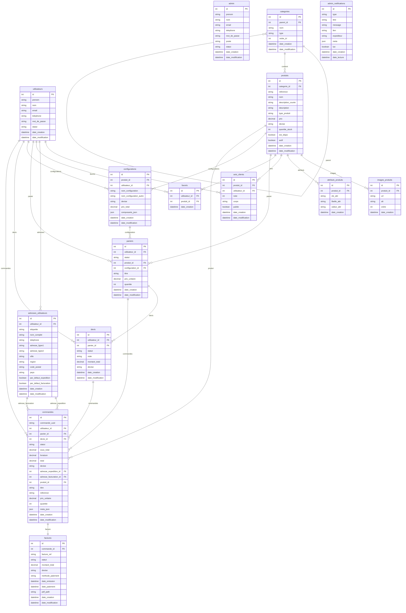

# Schema de relation (Les Casaniers)

Ce document decrit les relations entre les tables crees par les migrations fournies, puis donne un diagramme ER.

## Etapes

1. Creer les tables de base
   - admin
   - utilisateurs
   - categories
   - produits (FK categories)
   - images_produits (FK produits)
   - attributs_produits (FK produits)
2. Ajouter les tables fonctionnelles
   - avis_clients (FK produits, FK utilisateurs)
   - adresses_utilisateurs (FK utilisateurs)
   - favoris (FK utilisateurs, FK produits)
3. Creer le panier et ses liens
   - paniers (FK utilisateurs, FK produits, configuration_id)
4. Creer les configurations
   - configurations (FK produits, FK utilisateurs)
   - puis FK paniers.configuration_id -> configurations.id
5. Creer les devis et commandes
   - devis (FK utilisateurs, FK paniers)
   - commandes (FK utilisateurs, FK paniers, FK devis, FK adresses_utilisateurs)
6. Creer les factures
   - factures (FK commandes)
7. Creer les notifications admin
   - admin_notifications (pas de FK)

## Diagramme ER (Mermaid)

